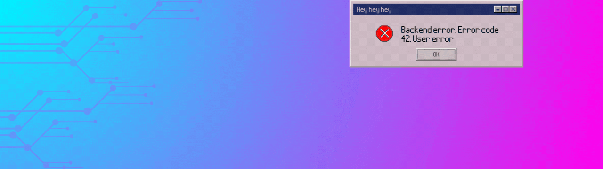

<!-- Banner Header -->

  

---

<!-- About Me -->

<table width="100%">
<tr>
<td width="65%" valign="top">

## 👨‍💻 About Me

⚙️ I'm an **Informatics Engineering student** at **Airlangga University**, class of **2024**.

🧠 Strong interest in **Web Development**, **Game Development**, **Databases**, **Cybersecurity**, **Machine Learning** and **Hardware & Software Systems**.

🛠️ Currently learning by **building projects independently** and exploring new technologies.

</td>
<td width="35%" align="center">
  
</td>
</tr>
</table>

---

<!-- Languanges & Tools -->

## 🛠️ Languages & Tools

💻 Languages

 

🧩 Frameworks

 

🌐 Web Development

 

🗄️ Tools & Environment

 

---

<!-- Projects -->

## 📂 Projects

🎓 Student Tasks

- **Pemrograman Basis Data**  
  📘 Projek UAS MK PBD 2025  
  🛠️ MySQL, SQL, Laravel                       
  🔗 [Repository](https://github.com/username/student-task-database)

- **Pengembangan Web Berbasis Framework**  
  📘 Projek UAS MK PWBF 2025  
  🛠️ Laravel                           
  🔗 [Repository](https://github.com/username/student-task-data-structures)

💼 Development Projects

- **Personal Portfolio Website**  
  🌐 A simple personal website to showcase my profile and projects  
  🛠️ HTML, CSS, JavaScript  
  🔗 [Repository](https://github.com/username/portfolio-website)

---

<!-- Hobbies and Connection-->

## 🎯 Hobbies & Interests

🎮 Games
 

  
  

🎬 Anime, Manga, Novels  & K-Drama
 

  
  

 🎸 Guitar & Singing 
 

  

---

<!-- GitHub Stats-->

## 📊 GitHub Stats

  

---

<!-- Footer -->

  © 2026 Fachriditya • Start with Passion, End with Character

