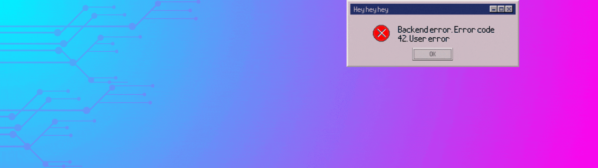

<!-- Banner Header -->

  

---

<!-- About Me -->

<table width="100%">
<tr>
<td width="65%" valign="top">

## 👨‍💻 About Me

⚙️ I'm an **Informatics Engineering student** at **Airlangga University**, class of **2024**.

🧠 Strong interest in **Software Development**, **Databases**, **Machine Learning**, **Cybersecurity**, **Cloud Computing**, **System Analyst**, and **Hardware & Software Technologies**.

🛠️ Currently learning by **building projects independently** and exploring new technologies.

</td>
<td width="35%" align="center">
  
</td>
</tr>
</table>

---

<!-- Languanges & Tools -->

## 🛠️ Languages & Tools

💻 Languages

 

🧩 Frameworks

 

🌐 Web Development

 

🗄️ Tools & Environment

 

---

<!-- Projects -->

## 📂 Projects

🎓 Student Tasks

- **Pemrograman Basis Data Praktikum**  
  📘 Projek UAS MK PBD Praktikum 2025  
  🛠️ MySQL, Laravel                       
  🔗 [Repository](https://github.com/Fachriditya/student-task-pbdprak-systeminventory-2025.git)

- **Pengembangan Web Berbasis Framework**  
  📘 Projek UAS MK PWBF Praktikum 2025  
  🛠️ Laravel                           
  🔗 [Repository](https://github.com/Fachriditya/student-task-pwbfprak-rshp-2025.git)

- **Pengujian Perangkat Lunak Praktikum**  
  📘 Personal project sederhana bertema tabungan keluarga menggunakan Laravel untuk MK PPL Praktikum 2026                          
  🛠️ MySQL, Laravel, Tailwind CSS                           
  🔗 [Repository](https://github.com/Fachriditya/student-task-pplprak-familywallet-2026.git)

- **Workshop Framework**  
  📘 Web untuk Modul-Modul Penugasan MK Workshop Framework 2026                          
  🛠️ Laravel                          
  🔗 [Repository](https://github.com/Fachriditya/student-task-frameworkshop-koleksibuku-2026.git)
  
- **Kecerdasan Buatan Praktikum**  
  📘 Projek UAS MK AI Praktikum 2026  
  🛠️ Laravel                           
  🔗 [Repository](https://github.com/Fachriditya/student-task-aiprak-scholartzy-2026.git)

- **Aplikasi Mobile Praktikum**  
  📘 Projek UAS MK Aplikasi Mobile Praktikum 2026  
  🛠️ Flutter                          
  🔗 [Repository](https://github.com/Fachriditya/student-task-mobileprak-ehelpdesk-2026.git)

💼 Development Projects

  
- **Qitchen Restaurant Workflow System (2026)**                                
  🌐 Personal project for a modern restaurant workflow and management system                       
  🛠️ Laravel, MySQL, Tailwind CSS                                  
  🔗 [Repository](https://github.com/Fachriditya/project-dev-qitchen-2026.git)

---

<!-- Hobbies and Connection-->

## 🎯 Hobbies & Interests

🎮 Games
 

  
  

🎬 Anime, Manga, Novels  & K-Drama
 

  
  

 🎸 Guitar & Singing 
 

  

---

<!-- GitHub Stats-->

## 📊 GitHub Stats

  <picture>
  <source media="(prefers-color-scheme: dark)"
          srcset="https://raw.githubusercontent.com/Fachriditya/Fachriditya/output/github-contribution-grid-snake-dark.svg" />
  
</picture>

---

<!-- Footer -->

  © 2026 Fachriditya • Just code it !!!

