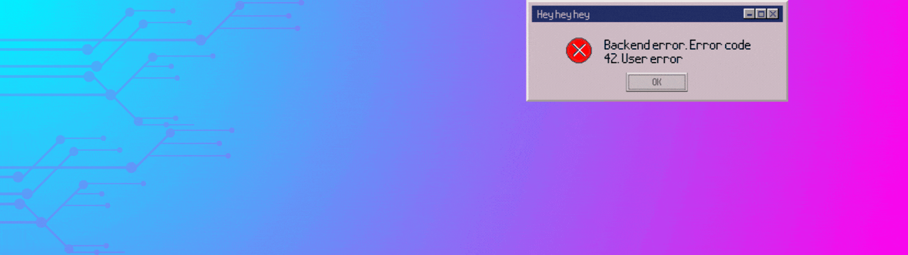

<!-- Banner Header -->


<div align="center">
  
</div>

---

<!-- About Me -->

## 👨‍💻 About Me

```json
{
  "developer": {
    "name": "Muhammad Fachriditya",
    "role": "Full-Stack Software Developer",
    "major": "Informatics Engineering",
    "university": "Airlangga University",
    "class": "2024",
    "location": "Surabaya, Indonesia 🇮🇩"
  },

  "focus": [
    "Software Engineering",
    "Full-Stack Development",
    "System Analysis",
    "Database Design",
    "Machine Learning"
  ]
}
```
---

<!-- Languanges & Tools -->

## 🛠️ Tech Stack

<table width="100%">
<tr>
<td width="65%" valign="top">

<summary>💻 Languages</summary>
<br>


<summary>🧩 Frameworks</summary>
<br>


<summary>🌐 Web Development</summary>
<br>


<summary>🗄️ Databases</summary>
<br>


<summary>🧰 Tools</summary>
<br>


<summary>⚙️ Environment</summary>
<br>


</td>
<td width="35%" align="center">
  
</td>
</tr>
</table>

---

<!-- Projects -->

## 📂 Projects

<details>
<summary>🎓 Academic Projects</summary>
  
- **Pemrograman Basis Data Praktikum**  
  📘 Projek UAS MK PBD Praktikum 2025  
  🛠️ MySQL, Laravel                       
  🔗 [Repository](https://github.com/Fachriditya/student-task-pbdprak-systeminventory-2025.git)

- **Pengembangan Web Berbasis Framework**  
  📘 Projek UAS MK PWBF Praktikum 2025  
  🛠️ Laravel                           
  🔗 [Repository](https://github.com/Fachriditya/student-task-pwbfprak-rshp-2025.git)

- **Pengujian Perangkat Lunak Praktikum**  
  📘 Personal project sederhana bertema tabungan keluarga menggunakan Laravel untuk MK PPL Praktikum 2026                          
  🛠️ MySQL, Laravel, Tailwind CSS                           
  🔗 [Repository](https://github.com/Fachriditya/student-task-pplprak-familywallet-2026.git)

- **Workshop Framework**  
  📘 Web untuk Modul-Modul Penugasan MK Workshop Framework 2026                          
  🛠️ Laravel                          
  🔗 [Repository](https://github.com/Fachriditya/student-task-frameworkshop-koleksibuku-2026.git)
  
- **Kecerdasan Buatan Praktikum**  
  📘 Projek UAS MK AI Praktikum 2026  
  🛠️ Laravel                           
  🔗 [Repository](https://github.com/Fachriditya/student-task-aiprak-scholartzy-2026.git)

- **Aplikasi Mobile Praktikum**  
  📘 Projek UAS MK Aplikasi Mobile Praktikum 2026  
  🛠️ Flutter                          
  🔗 [Repository](https://github.com/Fachriditya/student-task-mobileprak-ehelpdesk-2026.git)

</details>

<details>
<summary>🚀 Personal Projects</summary>
  
- **Qitchen**                      
  📘 A modern self-service restaurant workflow system.                                                
  🛠️ Laravel, MySQL, Tailwind CSS                      
  🔗 [Repository](https://github.com/Fachriditya/project-dev-qitchen-2026.git)            

</details>

<details>
<summary>🤝 Collaborative Projects</summary>

- **Re-Key**                                  
  📘 Website Edukasi Pengelolaan Limbah Plastik Menjadi Foldable Totebag Keychain.        
  🛠️ PHP Native            
  🔗 [Repository](https://github.com/cindytiaraa/kim-education.git)

</details>

<details>
<summary>💼 Professional Projects</summary>

- **SIKAS**                        
  📘 Sistem Informasi Kas Syariah untuk UMKM.            
  🛠️ Python, SQLite             
  🔗 [Repository](https://github.com/ZaganJade/SIKAS_Syariah.git)   

</details>

---

<!-- Hobbies and Connection-->

## 🎯 Hobbies & Interests

<summary>🎮 Games</summary><br>

  [](https://steamcommunity.com/profiles/76561199099882631/)
  [](https://store.epicgames.com/en-US/u/847a283e7c224102a6166ae0e8ee60f4)

<summary>🎬 Anime, Manga, Novels  & K-Drama</summary><br>

  [](https://discordapp.com/users/750964051697467433)
  
<summary> 🎸 Guitar & Singing </summary><br>

  [](https://open.spotify.com/user/h9hpwrgkdkam52nyt1861ye6k?si=7e0b3a3dee2d450f)


---

<!-- GitHub Stats-->

## 📊 GitHub Stats

<p align="center">
  <picture>
  <source media="(prefers-color-scheme: dark)"
          srcset="https://raw.githubusercontent.com/Fachriditya/Fachriditya/output/github-contribution-grid-snake-dark.svg" />
  
</picture>

</p>

---

<!-- Footer -->

<p align="center">
  © 2026 Fachriditya • Just code it !!!
</p>
